# PROJETO HIDROELÉTRICO

  - Juliana Barbacena Motta - 14/0147233
  - Tiago Simon Engelsdorff - 14/0032592
  - Gustavo Schafhauser Bocon - 14/0021761
  - Yann Uatanabi Gaspar de Almeida - 14/0166190

### Projeto do Aproveitamento - Nota: 6,0

O projeto do aproveitamento consistirá na realização e apresentação de cálculos oriundos de dados de um dado aproveitamento hidrelétrico visando a instalação de uma usina hidrelétrica. Cada item deverá ser respondido neste documento do repositório, usando a ferramenta de edição.

  - Cada grupo terá em sua pasta do repositório um conjunto de dados de vazão que deverá ser usado ao longo deste e dos demais projetos quando necessário;
  
  - Modelamento do aproveitamento hidrelétrico. Cada grupo deverá mostrar como ficará o sistema hidromecânico equivalente através do cálculo da energia hidráulica média disponível e do trabalho específico. O grupo 2 deverá usar a altura de cota **de 5 m** para seu aproveitamento hidrelétrico:

       

  - Determinação da queda do aproveitamento: O grupo 2 deverá considerar uma perda de **1 m**, onde cada grupo deverá especificar se a central será de baixa ou de alta queda;
  
    + Como a altura de cota do aproveitamento é baixa, 5 m, deve-se utilizar uma turbina com alta rotação específica, como a Turbina de reação do tipo Kaplan. Com isso, a central hidrelétrica do projeto será classificada como de Baixa Queda.
  
       
  - Determinação da vazão média de longo tempo baseado nos dados de vazão dados a cada grupo. Cada grupo deverá mostrar como fez este cálculo e as hipóteses adotadas;
  
    + Para a obtenção da vazão média de longo tempo, foi feita uma média das vazões medidas diariamente ao longo dos anos de 1931 a 2013, usando o software Excel. O valor obtido foi de 490,67 m³/s.
    
  - Cálculo da potência hidráulica máxima teórica média e da energia máxima teórica média;
  
    Para o cálculo da potência hidráulica máxima teórica média, foi usada a seguinte expressão:
  
    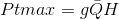
    
    Considerando H como a altura de cota (Hb) menos a perda (Hp), tem-se:
    
    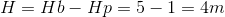
    
    Substituindo os valores de H = 4m, Q = 490,67m³/s e g = 9,81m²/s, temos:

    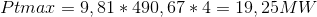
    
    A energia hidráulica máxima teórica média será dada pela expressão:

    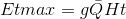
    
    Portanto, ao longo de um dia, a energia teórica máxima média gerada pelo aproveitamento é de:
    
    
  
  - Análise dos dados de vazão e energia máxima teórica média;
  
     A variação da vazão ao longo do tempo pode ser observada no gráfico presente na Figura 1 apresentada abaixo:
  
    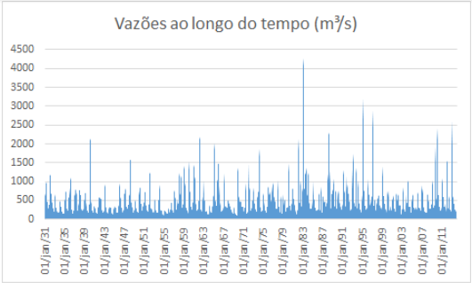
    
    Figura 1: Variação da vazão ao longo do tempo.
    
    A avaliação estatística dos dados de vazão observados diariamente, entre os anos de 1931 e 2013, está resumida na Tabela 1 abaixo:
    
    Tabela 1: Avaliação estatística dos dados de vazão.
    
    
    
    Como podemos notar, os valores de vazão no rio indicado são altamente inconstantes, possuindo variações bruscas como tendência,  característica observável pelo alto desvio padrão encontrado.
	  De semelhante modo, a energia que o aproveitamento seria capaz de gerar, com os valores obtidos, é diretamente proporcional à vazão, e, portanto, também seria relativamente inconstante. Essa característica prejudica o empreendimento, seja economicamente, com a geração de pouca energia em períodos de baixa vazão ou com a impossibilidade do aproveitamento dos períodos de vazão muito alta, dado a limitação estabelecida pela potência nominal, seja tecnicamente, pela maior dificuldade de operação da rede. Tal questão pode ser contornada através do dimensionamento de um reservatório que regularize a vazão turbinada, questão essa a ser explorada no arranjo técnico da usina.

  - Escolha do tipo de central e o arranjo utilizado;
  
    Assumindo que o aproveitamento em questão se trata de uma produção independente autoprodução ou autônoma, e que a área do reservatório delimitada pelo nível d’água máximo normal é igual ou inferior a 13km², e atende à condição:

    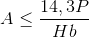
  
    onde P é o perímetro concernente à área delimitada, então esse aproveitamento pode ser classificado como uma Pequena Central Hidrelétrica (PCH), conforme as determinações da Resolução 652 da Agência Nacional de Energia Elétrica (ANEEL).
    
    Visto que a potência instalada leva em consideração os valores de vazão médios obtidos, os valores de vazão diários que estão abaixo da média não serão capazes de entregar a potência nominal da instalação. Por esse motivo, o arranjo adotado deverá ser de uma central de acumulação com regularização. Esse arranjo requer reservatórios maiores, de modo a acumular água do rio para produção no período de menor vazão.

  - Estimativa da potência instalada;
  
    A potência instalada pode ser calculada através da expressão:

    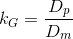
    
     Ao negligenciarmos os rendimentos do gerador e da turbina, visto que não conhecemos suas características, e considerarmos a vazão de projeto, Qp, como sendo a vazão média, temos:
    
    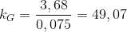
  
     Visto que será utilizada uma turbina Kaplan. temos que o desenho esquemático do sistema hidromecânico equivalente a ser instalado se encontra na imagem abaixo:
  
  - Desenho esquemático do sistema hidromecânico equivalente;
  
    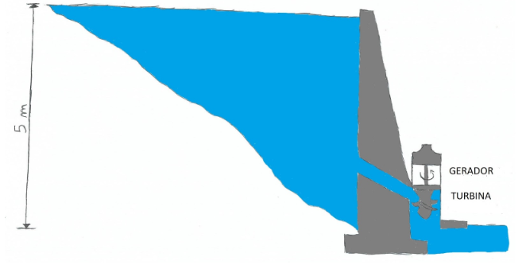
    
    Figura 2: Desenho esquemático do sistema hidromecânico equivalente.
  
  - Cada grupo deverá preencher uma ART (Anotação de Responsabilidade Técnica) para:

    - **Cargo e Função**, designando a tarefa de cada membro do grupo;
    - **Atuação**, designando os projetos a serem executados para a construção da usina;
    - **Obras e Serviços**, designando quais obras e serviços **relacionados a estudos, serviços e projetos civis** deverão ser executados para a construção da usina;

        Um arquivo de ajuda de preenchimento e um modelo de ART estão disponibilizados neste repositório. **Cada grupo deverá fazer suas ARTs baseado no modelo disponibilizado e fazer o *upload* para este repositório, sem recorrer a arquivos prontos na internet**;
        
- Projetos que não tiverem todos estes itens respondidos **não serão avaliados!**
Este projeto deverá ser feito neste arquivo, com o *upload* das respectivas ARTs, será até o dia **02/09/2018**. Pedidos de adiamento só serão concedidos em casos excepcionais, a serem decididos pelo professor.

### Projeto Hidrológico - Nota: 7,0

O projeto hidrológico consistirá na realização e apresentação de cálculos hidrológicos para o projeto de uma central hidrelétrica. Cada item deverá ser respondido neste documento do repositório, usando a ferramenta de edição.

  - Com os dados de vazão usados no projeto do aproveitamento, os grupos deverão identificar e organizar os dados em médias semanais (Se a disposição dos dados for diária) ou anuais (Se a disposição dos dados for mensal);
  
  - Cada grupo deverá realizar uma caracterização estatística destes dados. Para a caracterização dos dados, o grupo deverá utilizar de programação, onde a linguagem de programação é de livre escolha do grupo. **O algoritmo programado deverá ser enviado ao repositório via *upload*. Não será permitida a utilização de planilhas excel ou de programas já feitos**. Os seguintes itens deverão ser respondidos neste documento:
  
       - Fluviograma dos dados, dispostos em valores anuais e decenais;
       
       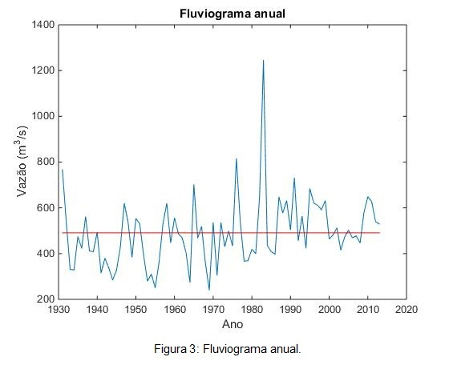
       
       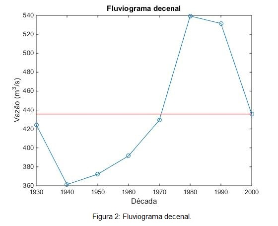
       
       - Curva de duração de vazões;
       
       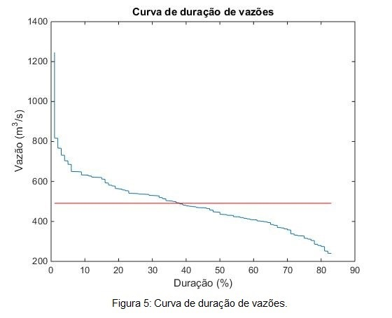 
       
       - Curva de duração de potência para uma queda (Determinada no projeto do aproveitamento) e rendimento de **85%**;
       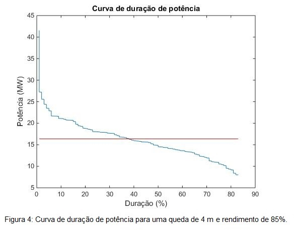
       
       - Diagrama de Rippl;   
       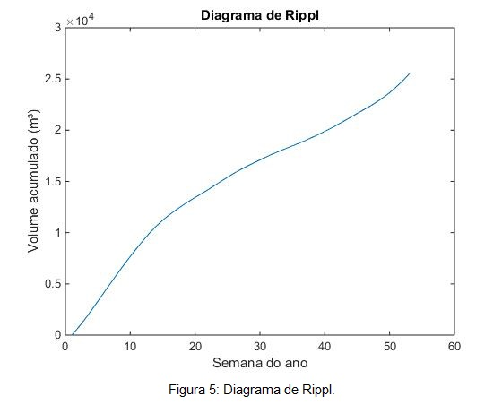

       - Determinação do período crítico;   
       
       A partir da Figura 6, pode-se determinar o período crítico, que é aquele que resulta na maior capacidade do reservatório. Considerando um coeficiente de regulariação de vazão igual a 1, ou seja, tomando a vazão necessária como a vazão média dos dados disponibilizados, temos que o período crítico é aproximadamente entre maio e dezembro.
       
       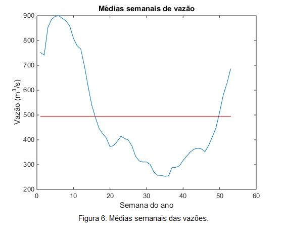
        
       - Determinação de períodos seco e úmido;
      
      O período seco corresponde aos meses do ano hidrológico em que ocorre o período crítico, ou seja, no caso analisado corresponde ao meses entre maio e dezembro.
       Já o período úmido são os meses restantes, no caso analisado, os meses de janeiro, fevereiro, março e abril.
        
       - Determinação de valores extremos;
       
       Como os dados do ano hidrológico e do ano civil são muito próximos para o nosso caso, pode-se admitir que são iguais. Com isso, a partir da Figura 6, é possível determinar os valores de vazão máxima e vazão mínima, os quais correspondem a 900 m³/s e 260 m³/s, respectivamente.
        
       - Estimativa da vazão firme e da vazão de projeto para dimensionamento de uma central hidrelétrica;
       
       A vazão firme é definida como a mínima vazão com que se pode contar e que possui uma frequência de ocorrência de, no mínimo, 95%. Com isso, a partir da Figura 3, definiu-se a Vazão Firme do projeto como sendo de 210 m³/s. E como a vazão de projeto deve ser menor que a vazão firme, definiu-se a Vazão de projeto como sendo 200 m³/s.
        
      
       - Cálculo da vazão regularizada: O grupo deverá fazer um cálculo da vazão regularizada baseado nos dados fornecidos de vazão. O método a ser usado é o método de Conti-Varlet. A formulação deste método está disponível no livro-texto do curso (Souza, Z., Santos, A. H. M e Bortoni, E. C.  **Centrais Hidrelétricas: Implantação e Comissionamento**, 2a. Edição, Editora Interciência.). Para este cálculo o grupo deverá:
        
       - Usar o programa disponibilizado pelo livro-texto do curso ou implementar o método em uma linguagem de programação da escolha do grupo. Caso o grupo escolha a segunda alternativa, **o algoritmo programado deverá ser enviado ao repositório via *upload***;
       
       - Análisar o resultado obtido de vazão regularizada e comparar este resultado com as vazões firme e de projeto calculados anteriormente;
       
       Para a realização do cálculo da vazão regularizada, foi utilizado o programa  Centrais Hidrelétricas, disponível em https://www.editorainterciencia.com.br/index.asp?pg=downloads.asp&token= que se encontra no livro Centrais Hidrelétricas: Implantação e Comissionamento, de Souza, Z. Santos A. H. M e Bortoni, E. C. Foi utilizado a função/programa Conti, que tem como entradas os dados de vazão obtidos para o estudo de caso, o volume útil de regularização, percentual do volume inicial e final do reservatório, número de discretizações e número de iterações. Para o caso deste estudo foi estabelecido o mesmo critério utilizado no livro texto, onde se determinou 78 como o número de discretizações e 3 o número de iterações. 
       
       Com a simulação do programa, foram obtidos um novo arquivo de saída com as vazões e os dados de vazão, e volume para regularização total, sendo esses equivalentes à 704,13 m³/s e 19820144 m³respectivamente. 
       
       O valor da vazão regularizada obtido nessa simulação é consideravelmente maior do que os valores de vazão firme e de projeto estimados previamente. Essa diferença tem impacto direto no tamanho do reservatório a ser construído de modo a regularizar a vazão. Sendo a vazão necessária para tocar o empreendimento tão maior do que a vazão que se pode contar com regularidade, o reservatório deverá ser grande de modo a acumular água nos períodos úmidos e permitir o aumento da vazão no período seco.
        
  - Projetos que não tiverem todos estes itens respondidos ou que estiverem incompletos **não serão avaliados!**
Este projeto deverá ser feito neste arquivo até o dia **23/09/2018**. Pedidos de adiamento só serão concedidos em casos excepcionais, a serem decididos pelo professor.

### Projeto do Conduto - Nota: 7,0

O projeto do conduto consistirá na realização e apresentação de cálculos de condutos e canais para a central hidrelétrica. 

   Podemos estimar o valor do coeficiente de Chézy através da fórmula de Manning como sendo:
  
  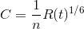
  
   Tomando o material das paredes do conduto como sendo concreto com acabamento ordinário, o valor tabelado do coeficiente de Gauckler-Manning para a rugosidade do conduto é de 0,014.
  Se considerarmos o escoamento como forçado, ou seja, preenchendo toda a área interna da tubulação, temos que:
  
  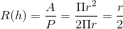
  
   Assim, podemos reescrever o coeficiente de Chézy para o escoamento em questão como:
  
  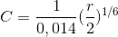
  
   Substituindo na fórmula de Chézy em função da vazão:
  
  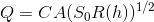
  
   Podemos assumir o valor da declividade do conduto através de uma aproximação razoável, sendo observados outros projetos de parâmetros semelhantes. Para o nosso caso, foi estimado um ângulo de 25° entre a horizontal e o fim do canal, o que nos leva a um valor para o coeficiente de inclinação de:
  
  

  - Projeto do canal para a futura usina hidrelétrica utilizando as fórmulas de Chezy, determinando de acordo com os dados de vazão de cada grupo:
     
       -A melhor forma geométrica de seção para o canal em questão;
       
       - O diâmetro hidráulico da seção;
       
         Substituindo os valores obtidos na fórmula de Chézy, e considerando a vazão média estimada no projeto do aproveitamento (490,67 m³/s), temos:
       
       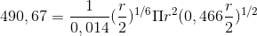
       
       Resolvendo esta equação, obtemos r = 1,84 m.
       
       Logo, o diâmetro hidráulico é de 3,68 m.
       
       - Velocidade da água no canal;
       
         Substituindo o valor do raio na equação da continuidade, temos:
       
       

       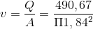

       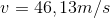
       
       - Vazão de água no canal;
       
         Para fins de cálculos, foi assumido que a vazão no canal é a mesma vazão média medida no rio, no caso 490,67 m³/s.
       
  - Baseado nos valores de queda dispostos no projeto do aproveitamento, o grupo deverá inserir no desenho esquemático deste projeto os seguintes itens:
        
       - Valores de cota de altura;
       - Alturas de queda;
       - Linhas piezométrica e de energia;
       
       Com o valor obtido para o diâmetro hidráulico, estabelecemos as linhas piezométrica e de energia, como pode ser visto na Figura 1 onde há uma relação das linhas com o desenho técnico e as respectivas cotas.
       
       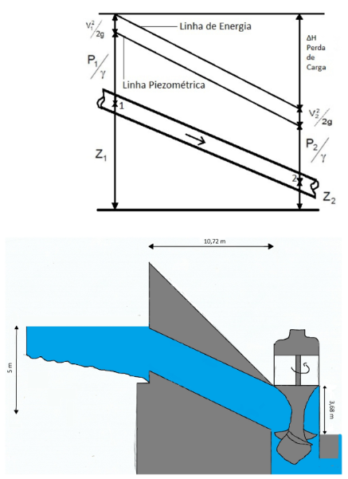
       
       Figura 9 - Desenho esquemático.
        
  - Determinação do semiperíodo da onda de pressão para dimensionamento do conduto fechado. Cada grupo poderá fazer as considerações que achar necessárias;
  
    Com o ângulo estimado de 25° entre a horizontal e o fim do canal, pode ser calculado o comprimento do tubo:
     
     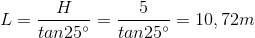
  
     Para o cálculo do tempo de parada do escoamento (tv), utilizou-se a fórmula empírica de Mendiluce:
     
     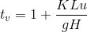
     
     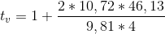
     
     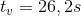
     
     
       Sendo, 
       
      L = comprimento do conduto;
      
      u = velocidade do escoamento;
      
      H = altura de queda;
      
      K = um coeficiente, tal que:
      
	 K = 2, quando L < 500m 
	
	 K = 1,5, quando 500m < L < 1500m
		  
	 K = 1, quando L > 1500m

      Calculando a Celeridade (Vs), obteve-se:
      
     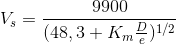
     
     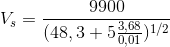
     
     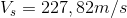
     
       Sendo,
       
     Km = 5, para o concreto;
     
     D = diâmetro do conduto;
     
     e = espessura do conduto. Adotou-se a espessura do conduto como sendo de 1cm.
     
     Para o cálculo do semiperíodo (T), obteve-se:
     
     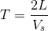
     
     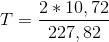
     
     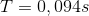
     
     Como tv>T, essa manobra é classificada como manobra lenta.
  
  - Determinação de valores de golpe de aríete positivo máximo;
  
    O valor do golpe de aríete positivo máximo (hs+) obtido foi de:
    
     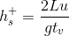
     
     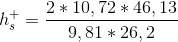
     
     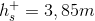
  
  - Determinação de valores do golpe de aríete aceitável;
  
    Como nossa central é de baixa queda, calculou-se o valor de Kb:
    
     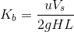
     
     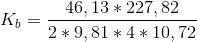
     
     
     
    Com isso, o valor do golpe de aríete aceitável (hs) será:
     
     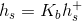
     
     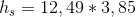
     
     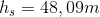
  
  - Projetos que não tiverem todos estes itens respondidos ou que estiverem incompletos **não serão avaliados!**
Este projeto deverá ser feito neste arquivo até o dia **07/10/2018**. Pedidos de adiamento só serão concedidos em casos excepcionais, a serem decididos pelo professor.

### Projeto da Turbina

O dimensionamento preliminar de uma turbina consistirá em determinar e dimensionar uma turbina para uma dado aproveitamento hidrelétrico. 

  - Cada grupo deverá especificar qual devem ser a potência e vazão da turbina a ser projetada, baseados nos cálculos dos projetos anteriores;
  
  	- De acordo com os cálculos realizados nos projetos anteriores, temos que a potência da turbina a ser instalada será de 19,25 MW e a vazão de 490,67 m³/s

  
  - Estime a rotação nominal da turbina, considerando um gerador com 10 pólos e frequência de corrente de 60 Hz;
  
  	- Tendo que p é o número de pólos e f a frequência, a rotação nominal é dada por: 
	
	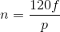
	
	Substituindo os valores, temos que a rotação nominal é n=720 rpm.

  - Para um modelo reduzido de 0,075 m de diâmetro, estime qual deve ser a razão de escala geométrica necessária para se obter os valores de potência e vazão determinados no primeiro item;
  	
	A razão de escala geométrica é dada por:
	
	 
	 
	 Onde:
	 
	 Dm = Diâmetro do modelo;
	 
	 Dp = Diâmetro do protótipo;
	 
	 kG = Escala geométrica.
	 
	 Considerando o valor do diâmetro do protótipo igual ao diâmetro do conduto, tem-se que Dp = 3,68m. Substituindo os valores, tem-se:
	 
	 
  
  - Mostre o triângulo de velocidades para estas condições para turbinas Kaplan, Francis e Pelton. Faça as considerações que achar necessárias e explique-as;
  
  	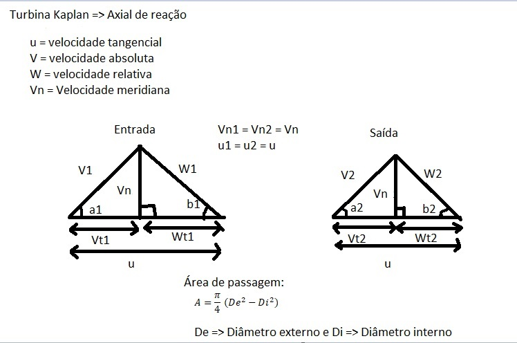
  
  	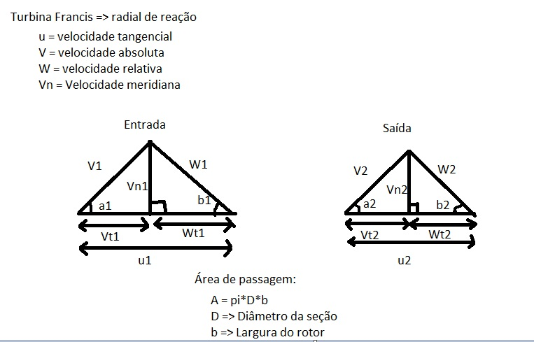
	
	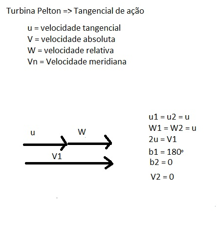
  
  - Determine a rotação específica e classifique a turbina como lenta, rápida ou extra-rápida;
  
  	- A rotação específica é dada por:
	
   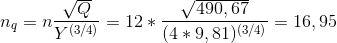
	
  Também, segundo a fórmula de Addison devido aos resultados muito pequenos usualmente encontrados na equação anterior:
	
   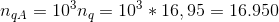

  - Estime a velocidade de disparo da turbina;
  
  A velocidade de disparo pode ser estimada através da equação:
  
   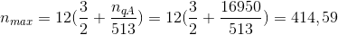

- Estime o fator de capacidade;
  
  O fator de capacidade pode ser calculado através da equação:
  
  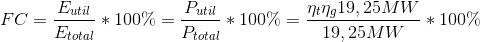
  
  Assumindo um rendimento de 90% para a turbina e de 95% para o gerador, temos:
  
  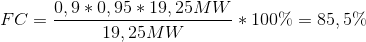
  
  - Qual é o tipo de turbina mais adequado para este aproveitamento?
  
  	- Henn (2008) apresenta o seguinte campo de aplicação para turbinas hidráulicas:
	
	
	
	Substituindo os valores de potência calculada, vazão e altura de queda no gráfico, podemos observar que o tipo de turbina mais adequado para este aproveitamento é uma turbina do tipo Kaplan de baixa queda.

  - Se for o caso, determine a altura de sucção e diga se existe risco de cavitação;
  
    A análise de cavitação começa pelo cálculo do fator de Thoma. Para turbinas do tipo Kaplan, o fator é dado conforme a equação:
  
	 

  Determinado o fator e Thoma, é possível calcular as perdas dentro da máquina:
  
	 
	 
  Sabe-se que o NPSH requerido é calculado como: 
  
  
  
  Tendo que a velocidade V2 é de 46,13 m/s, o NPSH requerido é igual a 108,56.

  Sabe-se que o NPSH disponível é calculado como: 
  
  
  
  Tendo que a pressão P2 é de aproximadamente 101,3 kPa, a pressão Pv é a pressão de vapor para a água a 20°C, que é de 2,3398 kPa, substituindo as variáveis temos um NPSH disponível de aproximadamente 108,46.
  Portanto, para não haver cavitação será necessária uma altura de sucção calculada por: 
  
  
  
  Logo, será necessária uma altura de sucção de 10 cm.

  - Com os cálculos, a usina que conterá esta turbina será classificada como? (Pequena central hidrelétrica, Grande central hidrelétrica, etc.)
  
  	- Assumindo que o aproveitamento em questão se trata de uma produção independente, autoprodução ou produção autônoma, e que a área do reservatório delimitada pelo nível d’água máximo normal é igual ou inferior a 13km², e atende à condição:
	
	 
	 
	 onde P é o perímetro concernente à área delimitada. Dado que a potência instalada se encontra na faixa de 1000 a 30000 kW, a instalação em questão pode ser classificada como uma pequena central hidrelétrica (PCH).
	
  - Projetos que não tiverem todos estes itens respondidos ou que estiverem incompletos **não serão avaliados!**

Os dados faltantes poderão ser estimados pelo grupo, desde que a forma de estimativa seja devidamente explicada. É facultada a utilização de ferramentas computacionais. Este projeto deverá ser feito neste arquivo até o dia **25/11/2018**. Pedidos de adiamento só serão concedidos em casos excepcionais, a serem decididos pelo professor.
